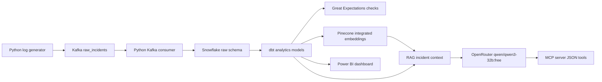

# SmartOps AI Architecture

SmartOps AI is an end-to-end AI operations analytics platform for 1M+ synthetic infrastructure events. It combines streaming, warehouse modeling, data validation, vector search, LLM reasoning, operational tools, CI, containers, and dashboarding.

## Technology Stack

- Kafka for streaming infrastructure events.
- Python for generation, ingestion, validation, RAG, and MCP services.
- Snowflake for raw and analytics storage.
- dbt for warehouse transformations.
- Great Expectations for data quality checks.
- Pinecone for vector search with integrated embeddings.
- OpenRouter for LLM inference using `qwen/qwen3-32b:free`.
- MCP for operational tool access.
- Docker and Docker Compose for production-style runtime.
- GitHub Actions for CI validation.
- Power BI for final dashboarding after Snowflake data is loaded.

## Data Flow



## Event Generation

The producer creates realistic synthetic infrastructure incidents across regions, servers, event types, severities, and metrics. Event types include CPU spikes, memory pressure, API latency, auth failures, and database errors.

The target workload is 1M+ synthetic infrastructure events, making the project suitable for demonstrating streaming scale, warehouse modeling, and BI reporting.

## Ingestion

Kafka receives generated events in the `raw_incidents` topic. The Python consumer validates required fields, allowed severities, allowed regions, timestamp format, and metadata shape. Valid warning and critical incidents are written to Snowflake, while invalid events are sent to a Snowflake dead-letter table.

## Warehouse Layer

Snowflake stores both raw and transformed data. dbt models create staging and mart tables such as:

- `stg_incidents`
- `stg_incident_metrics`
- `dim_regions`
- `fct_incidents`

Great Expectations validates data quality rules such as uniqueness, allowed values, date ranges, metric ranges, and row completeness.

## RAG Layer

The embeddings refresh job reads recent incident history from Snowflake and writes records to Pinecone. Pinecone uses integrated embeddings with `llama-text-embed-v2`, so the application does not run its own embedding model.

The RAG assistant combines:

- Current Snowflake incidents
- Historical Pinecone matches
- OpenRouter chat completion

The LLM endpoint is:

```text
https://openrouter.ai/api/v1/chat/completions
```

The model is:

```text
qwen/qwen3-32b:free
```

## MCP Layer

The MCP server exposes operational tools through plain JSON:

- `query_incidents`
- `query_snowflake`
- `get_incident_history`
- `suggest_runbook`
- `kafka_health_check`

`query_snowflake` is read-only and blocks mutating SQL.

## Dashboard Layer

Power BI is the final step after data is loaded and transformed in Snowflake. It is intentionally not included in Docker because it is a desktop reporting workflow.
